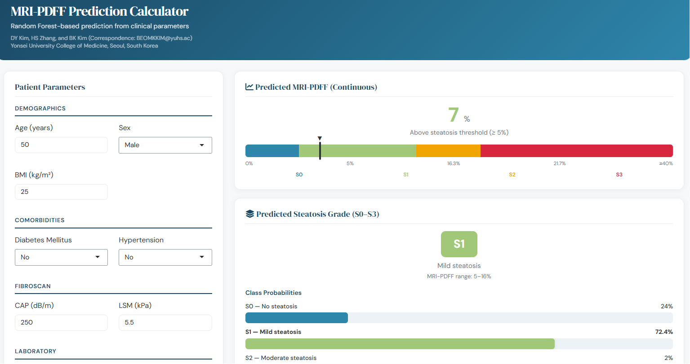

# MRI-PDFF Prediction Calculator

[](https://lifecycle.r-lib.org/articles/stages.html#experimental)
[](https://zionstar12.shinyapps.io/mri_pdff_calculator/)
[](https://www.gnu.org/licenses/gpl-3.0)

**A web-based clinical prediction tool for hepatic steatosis using Random Forest models trained on FibroScan, laboratory, and demographic parameters.**

### **[→ Launch the live calculator](https://zionstar12.shinyapps.io/mri_pdff_calculator/)**

---



## Overview

This R Shiny application predicts:

1. **Continuous MRI-PDFF (%)** — the estimated hepatic proton density fat fraction (PDFF), displayed with a colour-coded steatosis spectrum bar.
2. **Steatosis grade (S0–S3)** — the most probable histological grade with class probabilities, where S0 = no steatosis (< 5%), S1 = mild (5–16%), S2 = moderate (16–22%), and S3 = severe (≥ 22%).

Both predictions are generated by separate Random Forest models (`ranger`) and are computed independently from the same set of clinical inputs.

## Input Parameters

The calculator accepts 15 routinely available clinical variables:

| Category | Parameters |
|---|---|
| **Demographics** | Age, Sex, BMI |
| **Comorbidities** | Diabetes mellitus, Hypertension |
| **FibroScan** | CAP (dB/m), LSM (kPa) |
| **Laboratory** | AST, ALT, Fasting glucose, Total cholesterol, HDL, Platelets, Albumin, Total bilirubin |

An AST/ALT ratio is computed internally as a derived feature.

## Getting Started

### Use online

Visit the live application: **<https://zionstar12.shinyapps.io/mri_pdff_calculator/>**

### Run locally

```r
# Install required packages
install.packages(c("shiny", "bslib", "ranger", "caret", "ggplot2"))

# Clone and run
shiny::runGitHub("MRI-PDFF-Calculator", "zionstar12")
```

Or clone the repository manually:

```bash
git clone https://github.com/zionstar12/MRI-PDFF-Calculator.git
cd MRI-PDFF-Calculator
```

Then open `app.R` in RStudio and click **Run App**.

## Repository Structure

```
MRI-PDFF-Calculator/
├── app.R                          # Shiny application (UI + server)
├── rf_continuous_model.rds        # Trained RF model for continuous MRI-PDFF prediction
├── rf_multicat_model.rds          # Trained RF model for steatosis grade (S0–S3) prediction
├── man/
│   └── figures/
│       └── screenshot.png         # Application screenshot
├── .gitignore
├── LICENSE.md                     # GPL-3
└── README.md
```

## Methods

The prediction models were developed following [TRIPOD](https://www.tripod-statement.org/) reporting guidelines. Key methodological details:

- **Modelling framework:** Random Forest via `ranger` (R package), with separate models for continuous MRI-PDFF regression and multicatetory (four-class) steatosis grade classification.
- **Reference standard:** MRI-PDFF measured by magnetic resonance imaging (MRI).
- **Input validation:** The calculator flags out-of-range values and prevents prediction when required fields are missing.

For full methodological details, an associated manuscript will be soon available (currently under review).

## Disclaimer

> **⚠ Research Use Only.** This calculator is intended for research purposes only and has not been externally validated for clinical decision-making. Predictions are based on Random Forest models trained on a specific study cohort and may not generalise to all patient populations. MRI-PDFF remains the reference standard for hepatic fat quantification.

## Citation

If you use this calculator in published work, please cite:

```
DY Kim, HS Zhang, BK Kim.
MRI-PDFF Prediction Calculator: Random Forest-based prediction from clinical parameters.
Yonsei University College of Medicine, Seoul, South Korea.
[Manuscript under review]
```

## Authors

- **DY Kim**: Dept. of Hepatology, Yonsei University College of Medicine
- **HS Zhang**: Dept. of Biomedical Systems Informatics, Yonsei University College of Medicine
- **BK Kim** (Correspondence: BEOMKKIM@yuhs.ac): Dept. of Hepatology, Yonsei University College of Medicine

## License

GPL-3. See [LICENSE.md](LICENSE.md) for details.
